# Diagram gallery

This page renders the canonical Mermaid sources for review. The `.mmd` files remain authoritative; refresh this gallery when their sources change. For the complete class model, use the [four readable class views](class-views.md) and [full source](diagrams/06-detailed-design.mmd). Descriptions and logical-design contracts are in the [design guide](README.md).

## 01-context

[Source](diagrams/01-context.mmd)

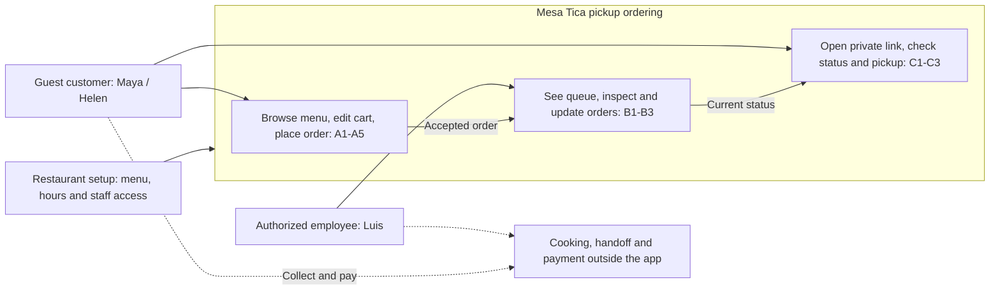
```mermaid
flowchart LR
    Customer["Guest customer: Maya / Helen"]
    Staff["Authorized employee: Luis"]
    Setup["Restaurant setup: menu, hours and staff access"]
    Physical["Cooking, handoff and payment outside the app"]
    subgraph Product["Mesa Tica pickup ordering"]
        Ordering["Browse menu, edit cart, place order: A1-A5"]
        Operations["See queue, inspect and update orders: B1-B3"]
        Tracking["Open private link, check status and pickup: C1-C3"]
    end
    Customer --> Ordering
    Customer --> Tracking
    Staff --> Operations
    Setup --> Product
    Ordering -->|"Accepted order"| Operations
    Operations -->|"Current status"| Tracking
    Staff -.-> Physical
    Customer -.->|"Collect and pay"| Physical
```

## 02-product-concepts

[Source](diagrams/02-product-concepts.mmd)

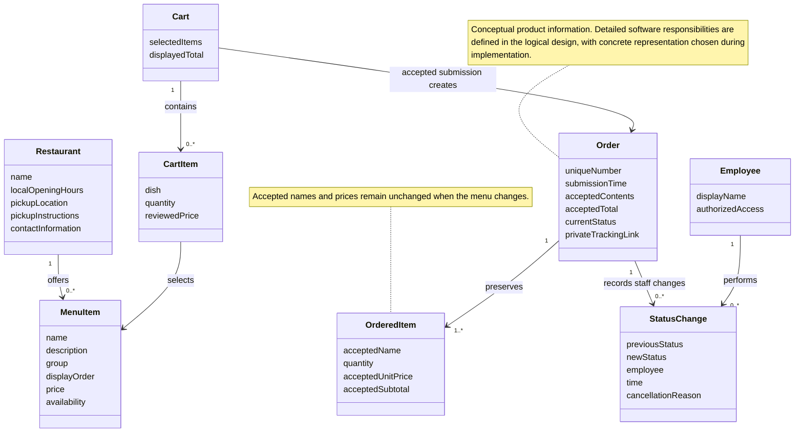
```mermaid
classDiagram
    class Restaurant {
        name
        localOpeningHours
        pickupLocation
        pickupInstructions
        contactInformation
    }
    class MenuItem {
        name
        description
        group
        displayOrder
        price
        availability
    }
    class Cart {
        selectedItems
        displayedTotal
    }
    class CartItem {
        dish
        quantity
        reviewedPrice
    }
    class Order {
        uniqueNumber
        submissionTime
        acceptedContents
        acceptedTotal
        currentStatus
        privateTrackingLink
    }
    class OrderedItem {
        acceptedName
        quantity
        acceptedUnitPrice
        acceptedSubtotal
    }
    class StatusChange {
        previousStatus
        newStatus
        employee
        time
        cancellationReason
    }
    class Employee {
        displayName
        authorizedAccess
    }
    Restaurant "1" --> "0..*" MenuItem : offers
    Cart "1" --> "0..*" CartItem : contains
    CartItem --> MenuItem : selects
    Cart --> Order : accepted submission creates
    Order "1" --> "1..*" OrderedItem : preserves
    Order "1" --> "0..*" StatusChange : records staff changes
    Employee "1" --> "0..*" StatusChange : performs
    note for Order "Conceptual product information. Detailed software responsibilities are<br/>defined in the logical design, with concrete representation chosen during<br/>implementation."
    note for OrderedItem "Accepted names and prices remain unchanged when the menu changes."
```

## 03-order-lifecycle

[Source](diagrams/03-order-lifecycle.mmd)

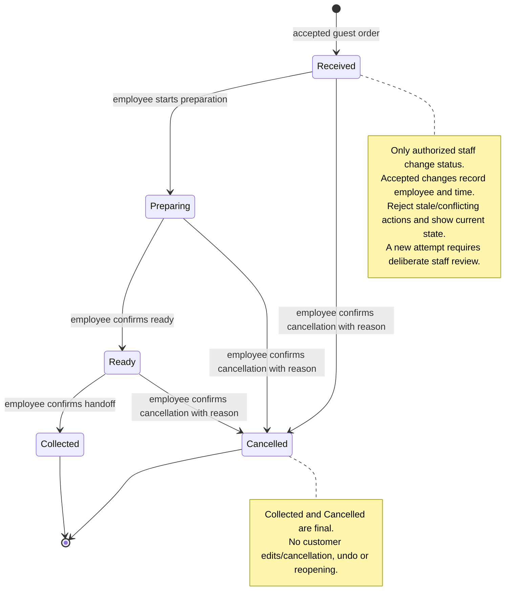
```mermaid
stateDiagram-v2
    [*] --> Received: accepted guest order
    Received --> Preparing: employee starts preparation
    Preparing --> Ready: employee confirms ready
    Ready --> Collected: employee confirms handoff
    Received --> Cancelled: employee confirms cancellation with reason
    Preparing --> Cancelled: employee confirms cancellation with reason
    Ready --> Cancelled: employee confirms cancellation with reason
    Collected --> [*]
    Cancelled --> [*]
    note right of Received
        Only authorized staff change status.
        Accepted changes record employee and time.
        Reject stale/conflicting actions and show current state.
        A new attempt requires deliberate staff review.
    end note
    note right of Cancelled
        Collected and Cancelled are final.
        No customer edits/cancellation, undo or reopening.
    end note
```

## 04-product-rules

[Source](diagrams/04-product-rules.mmd)

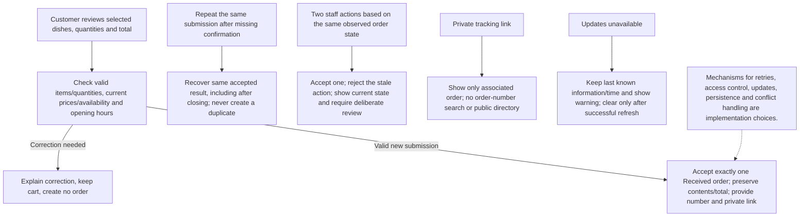
```mermaid
flowchart TB
    Review["Customer reviews selected dishes, quantities and total"] --> Check["Check valid items/quantities, current prices/availability and opening hours"]
    Check -->|"Correction needed"| Correct["Explain correction, keep cart, create no order"]
    Check -->|"Valid new submission"| Accept["Accept exactly one Received order; preserve contents/total; provide number and private link"]
    Retry["Repeat the same submission after missing confirmation"] --> Recover["Recover same accepted result, including after closing; never create a duplicate"]
    Conflict["Two staff actions based on the same observed order state"] --> One["Accept one; reject the stale action; show current state and require deliberate review"]
    Link["Private tracking link"] --> Associated["Show only associated order; no order-number search or public directory"]
    Lost["Updates unavailable"] --> Stale["Keep last known information/time and show warning; clear only after successful refresh"]
    note1["Mechanisms for retries, access control, updates, persistence and conflict handling are implementation choices."]
    note1 -.-> Accept
```

## 05-logical-architecture

[Source](diagrams/05-logical-architecture.mmd)

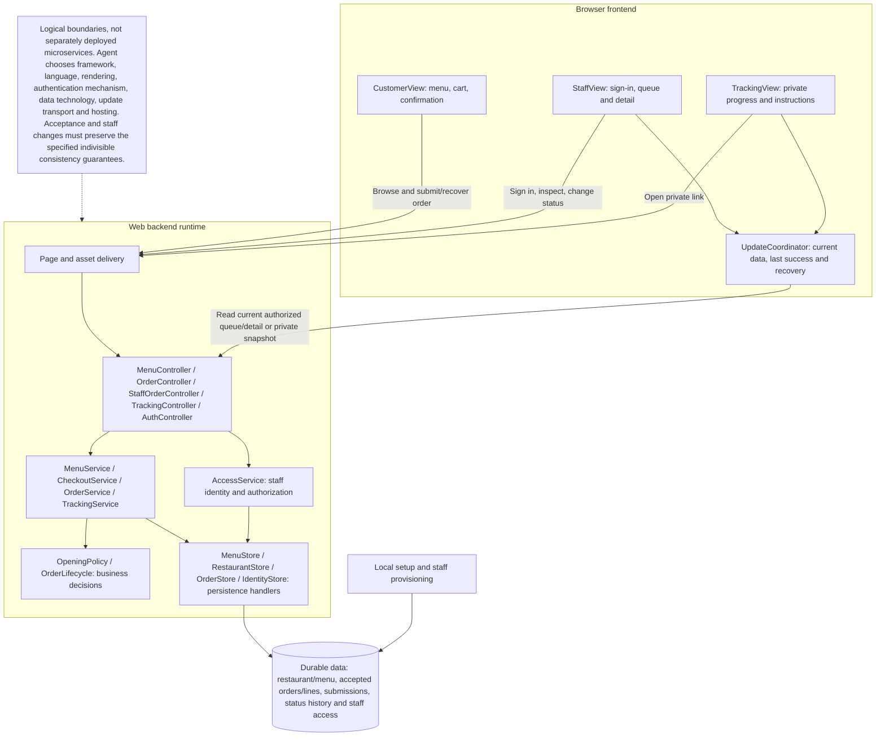
```mermaid
flowchart TB
    subgraph Browser["Browser frontend"]
        Customer["CustomerView: menu, cart, confirmation"]
        Staff["StaffView: sign-in, queue and detail"]
        Tracking["TrackingView: private progress and instructions"]
        Updates["UpdateCoordinator: current data, last success and recovery"]
        Staff --> Updates
        Tracking --> Updates
    end
    subgraph Backend["Web backend runtime"]
        Delivery["Page and asset delivery"]
        Boundaries["MenuController / OrderController / StaffOrderController / TrackingController / AuthController"]
        Access["AccessService: staff identity and authorization"]
        Services["MenuService / CheckoutService / OrderService / TrackingService"]
        Policies["OpeningPolicy / OrderLifecycle: business decisions"]
        Stores["MenuStore / RestaurantStore / OrderStore / IdentityStore: persistence handlers"]
        Delivery --> Boundaries
        Boundaries --> Access
        Boundaries --> Services
        Services --> Policies
        Services --> Stores
        Access --> Stores
    end
    Durable[("Durable data: restaurant/menu, accepted orders/lines, submissions, status history and staff access")]
    Setup["Local setup and staff provisioning"]
    Customer -->|"Browse and submit/recover order"| Delivery
    Staff -->|"Sign in, inspect, change status"| Delivery
    Tracking -->|"Open private link"| Delivery
    Updates -->|"Read current authorized queue/detail or private snapshot"| Boundaries
    Stores --> Durable
    Setup --> Durable
    Decisions["Logical boundaries, not separately deployed microservices. Agent chooses framework, language, rendering, authentication mechanism, data technology, update transport and hosting. Acceptance and staff changes must preserve the specified indivisible consistency guarantees."]
    Decisions -.-> Backend
```

## A1-menu

[Source](diagrams/A1-menu.mmd)

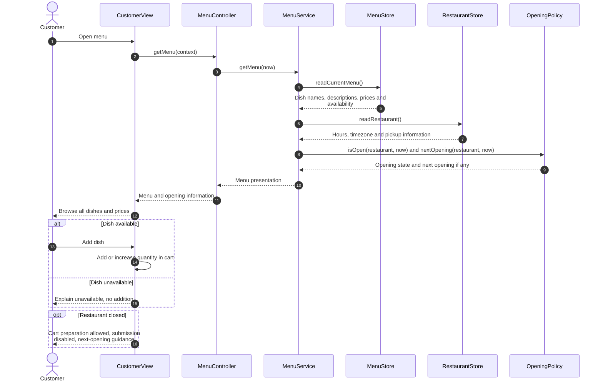
```mermaid
%%{init: {"sequence": {"wrap": true, "width": 200, "actorMargin": 35}}}%%
sequenceDiagram
    autonumber
    actor Customer
    participant UI as CustomerView
    participant C as MenuController
    participant S as MenuService
    participant M as MenuStore
    participant R as RestaurantStore
    participant P as OpeningPolicy
    Customer->>UI: Open menu
    UI->>C: getMenu(context)
    C->>S: getMenu(now)
    S->>M: readCurrentMenu()
    M-->>S: Dish names, descriptions, prices and availability
    S->>R: readRestaurant()
    R-->>S: Hours, timezone and pickup information
    S->>P: isOpen(restaurant, now) and nextOpening(restaurant, now)
    P-->>S: Opening state and next opening if any
    S-->>C: Menu presentation
    C-->>UI: Menu and opening information
    UI-->>Customer: Browse all dishes and prices
    alt Dish available
    Customer->>UI: Add dish
    UI->>UI: Add or increase quantity in cart
    else Dish unavailable
    UI-->>Customer: Explain unavailable, no addition
    end
    opt Restaurant closed
    UI-->>Customer: Cart preparation allowed, submission disabled, next-opening guidance
    end
```

## A2-cart

[Source](diagrams/A2-cart.mmd)

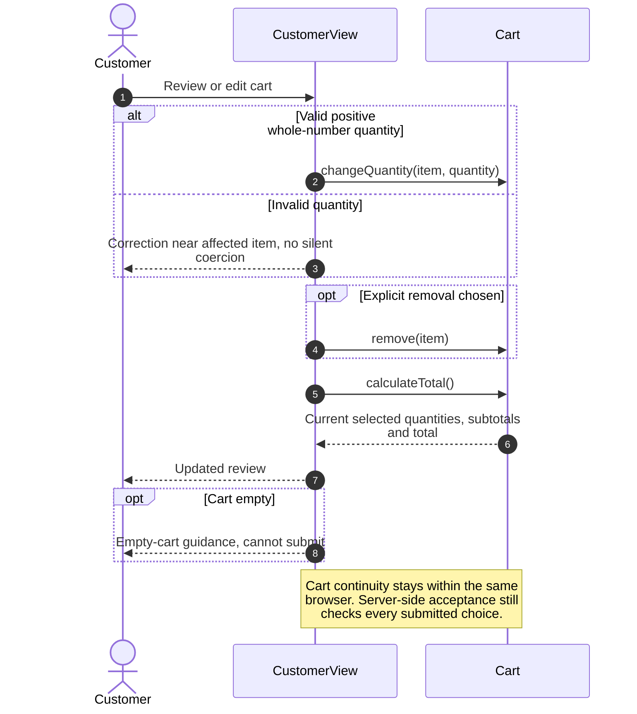
```mermaid
%%{init: {"sequence": {"wrap": true, "width": 200, "actorMargin": 35}}}%%
sequenceDiagram
    autonumber
    actor Customer
    participant UI as CustomerView
    participant Cart as Cart
    Customer->>UI: Review or edit cart
    alt Valid positive whole-number quantity
    UI->>Cart: changeQuantity(item, quantity)
    else Invalid quantity
    UI-->>Customer: Correction near affected item, no silent coercion
    end
    opt Explicit removal chosen
    UI->>Cart: remove(item)
    end
    UI->>Cart: calculateTotal()
    Cart-->>UI: Current selected quantities, subtotals and total
    UI-->>Customer: Updated review
    opt Cart empty
    UI-->>Customer: Empty-cart guidance, cannot submit
    end
    Note over UI,Cart: Cart continuity stays within the same browser. Server-side acceptance still checks every submitted choice.
```

## A3-checkout

[Source](diagrams/A3-checkout.mmd)

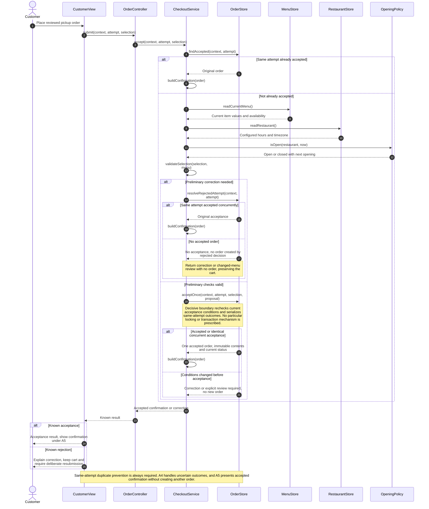
```mermaid
%%{init: {"sequence": {"wrap": true, "width": 200, "actorMargin": 35}}}%%
sequenceDiagram
    autonumber
    actor Customer
    participant UI as CustomerView
    participant C as OrderController
    participant S as CheckoutService
    participant O as OrderStore
    participant M as MenuStore
    participant R as RestaurantStore
    participant P as OpeningPolicy
    Customer->>UI: Place reviewed pickup order
    UI->>C: submit(context, attempt, selection)
    C->>S: accept(context, attempt, selection)
    S->>O: findAccepted(context, attempt)
    alt Same attempt already accepted
    O-->>S: Original order
    S->>S: buildConfirmation(order)
    else Not already accepted
    S->>M: readCurrentMenu()
    M-->>S: Current item values and availability
    S->>R: readRestaurant()
    R-->>S: Configured hours and timezone
    S->>P: isOpen(restaurant, now)
    P-->>S: Open or closed with next opening
    S->>S: validateSelection(selection, menu)
    alt Preliminary correction needed
    S->>O: resolveRejectedAttempt(context, attempt)
    alt Same attempt accepted concurrently
    O-->>S: Original acceptance
    S->>S: buildConfirmation(order)
    else No accepted order
    O-->>S: No acceptance, no order created by rejected decision
    Note over S,O: Return correction or changed-menu review with no order, preserving the cart.
    end
    else Preliminary checks valid
    S->>O: acceptOnce(context, attempt, selection, proposal)
    Note over S,O: Decisive boundary rechecks current acceptance conditions and serializes same-attempt outcomes. No particular locking or transaction mechanism is prescribed.
    alt Accepted or identical concurrent acceptance
    O-->>S: One accepted order, immutable contents and current status
    S->>S: buildConfirmation(order)
    else Conditions changed before acceptance
    O-->>S: Correction or explicit review required, no new order
    end
    end
    end
    S-->>C: Accepted confirmation or correction
    C-->>UI: Known result
    alt Known acceptance
    UI-->>Customer: Acceptance result, show confirmation under A5
    else Known rejection
    UI-->>Customer: Explain correction, keep cart and require deliberate resubmission
    end
    Note over UI,O: Same-attempt duplicate prevention is always required. A4 handles uncertain outcomes, and A5 presents accepted confirmation without creating another order.
```

## A4-submission-recovery

[Source](diagrams/A4-submission-recovery.mmd)

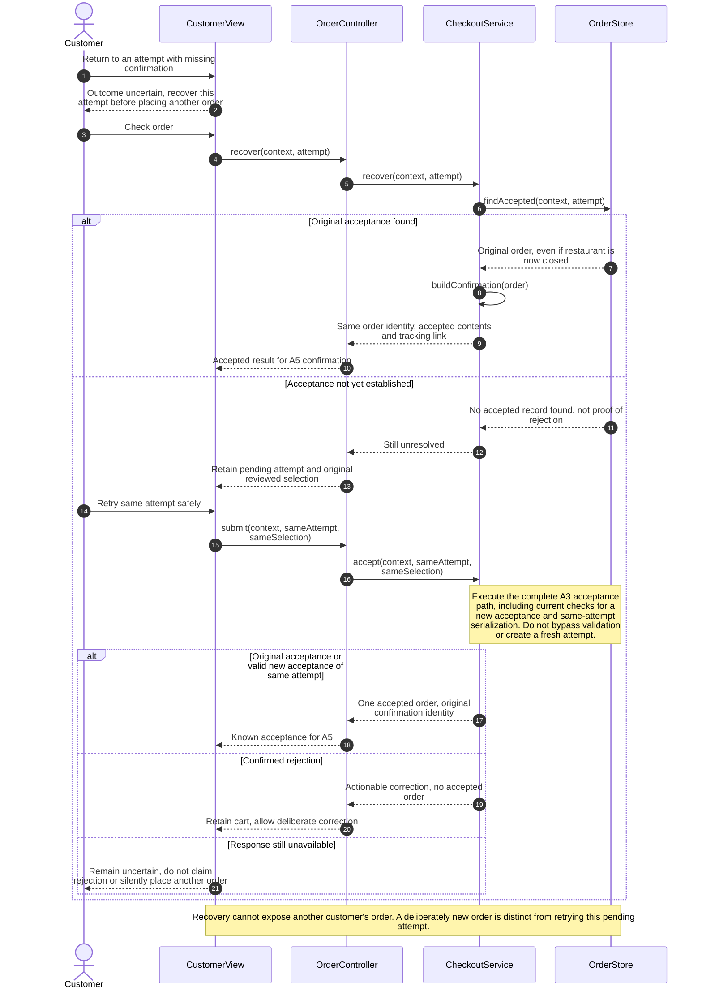
```mermaid
%%{init: {"sequence": {"wrap": true, "width": 200, "actorMargin": 35}}}%%
sequenceDiagram
    autonumber
    actor Customer
    participant UI as CustomerView
    participant C as OrderController
    participant S as CheckoutService
    participant O as OrderStore
    Customer->>UI: Return to an attempt with missing confirmation
    UI-->>Customer: Outcome uncertain, recover this attempt before placing another order
    Customer->>UI: Check order
    UI->>C: recover(context, attempt)
    C->>S: recover(context, attempt)
    S->>O: findAccepted(context, attempt)
    alt Original acceptance found
    O-->>S: Original order, even if restaurant is now closed
    S->>S: buildConfirmation(order)
    S-->>C: Same order identity, accepted contents and tracking link
    C-->>UI: Accepted result for A5 confirmation
    else Acceptance not yet established
    O-->>S: No accepted record found, not proof of rejection
    S-->>C: Still unresolved
    C-->>UI: Retain pending attempt and original reviewed selection
    Customer->>UI: Retry same attempt safely
    UI->>C: submit(context, sameAttempt, sameSelection)
    C->>S: accept(context, sameAttempt, sameSelection)
    Note over S,O: Execute the complete A3 acceptance path, including current checks for a new acceptance and same-attempt serialization. Do not bypass validation or create a fresh attempt.
    alt Original acceptance or valid new acceptance of same attempt
    S-->>C: One accepted order, original confirmation identity
    C-->>UI: Known acceptance for A5
    else Confirmed rejection
    S-->>C: Actionable correction, no accepted order
    C-->>UI: Retain cart, allow deliberate correction
    else Response still unavailable
    UI-->>Customer: Remain uncertain, do not claim rejection or silently place another order
    end
    end
    Note over UI,O: Recovery cannot expose another customer's order. A deliberately new order is distinct from retrying this pending attempt.
```

## A5-confirmation-link

[Source](diagrams/A5-confirmation-link.mmd)

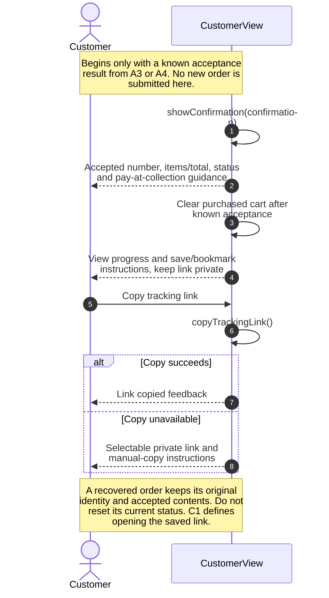
```mermaid
%%{init: {"sequence": {"wrap": true, "width": 200, "actorMargin": 35}}}%%
sequenceDiagram
    autonumber
    actor Customer
    participant UI as CustomerView
    Note over Customer,UI: Begins only with a known acceptance result from A3 or A4. No new order is submitted here.
    UI->>UI: showConfirmation(confirmation)
    UI-->>Customer: Accepted number, items/total, status and pay-at-collection guidance
    UI->>UI: Clear purchased cart after known acceptance
    UI-->>Customer: View progress and save/bookmark instructions, keep link private
    Customer->>UI: Copy tracking link
    UI->>UI: copyTrackingLink()
    alt Copy succeeds
    UI-->>Customer: Link copied feedback
    else Copy unavailable
    UI-->>Customer: Selectable private link and manual-copy instructions
    end
    Note over Customer,UI: A recovered order keeps its original identity and accepted contents. Do not reset its current status. C1 defines opening the saved link.
```

## B1-queue

[Source](diagrams/B1-queue.mmd)

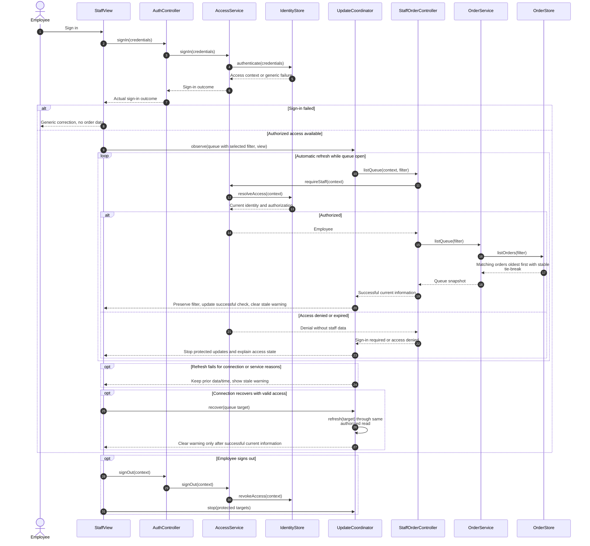
```mermaid
%%{init: {"sequence": {"wrap": true, "width": 200, "actorMargin": 35}}}%%
sequenceDiagram
    autonumber
    actor Employee
    participant UI as StaffView
    participant A as AuthController
    participant Access as AccessService
    participant I as IdentityStore
    participant U as UpdateCoordinator
    participant C as StaffOrderController
    participant S as OrderService
    participant O as OrderStore
    Employee->>UI: Sign in
    UI->>A: signIn(credentials)
    A->>Access: signIn(credentials)
    Access->>I: authenticate(credentials)
    I-->>Access: Access context or generic failure
    Access-->>A: Sign-in outcome
    A-->>UI: Actual sign-in outcome
    alt Sign-in failed
    UI-->>Employee: Generic correction, no order data
    else Authorized access available
    UI->>U: observe(queue with selected filter, view)
    loop Automatic refresh while queue open
    U->>C: listQueue(context, filter)
    C->>Access: requireStaff(context)
    Access->>I: resolveAccess(context)
    I-->>Access: Current identity and authorization
    alt Authorized
    Access-->>C: Employee
    C->>S: listQueue(filter)
    S->>O: listOrders(filter)
    O-->>S: Matching orders oldest first with stable tie-break
    S-->>C: Queue snapshot
    C-->>U: Successful current information
    U-->>UI: Preserve filter, update successful check, clear stale warning
    else Access denied or expired
    Access-->>C: Denial without staff data
    C-->>U: Sign-in required or access denied
    U-->>UI: Stop protected updates and explain access state
    end
    end
    opt Refresh fails for connection or service reasons
    U-->>UI: Keep prior data/time, show stale warning
    end
    opt Connection recovers with valid access
    UI->>U: recover(queue target)
    U->>U: refresh(target) through same authorized read
    U-->>UI: Clear warning only after successful current information
    end
    end
    opt Employee signs out
    UI->>A: signOut(context)
    A->>Access: signOut(context)
    Access->>I: revokeAccess(context)
    UI->>U: stop(protected targets)
    end
```

## B2-detail

[Source](diagrams/B2-detail.mmd)

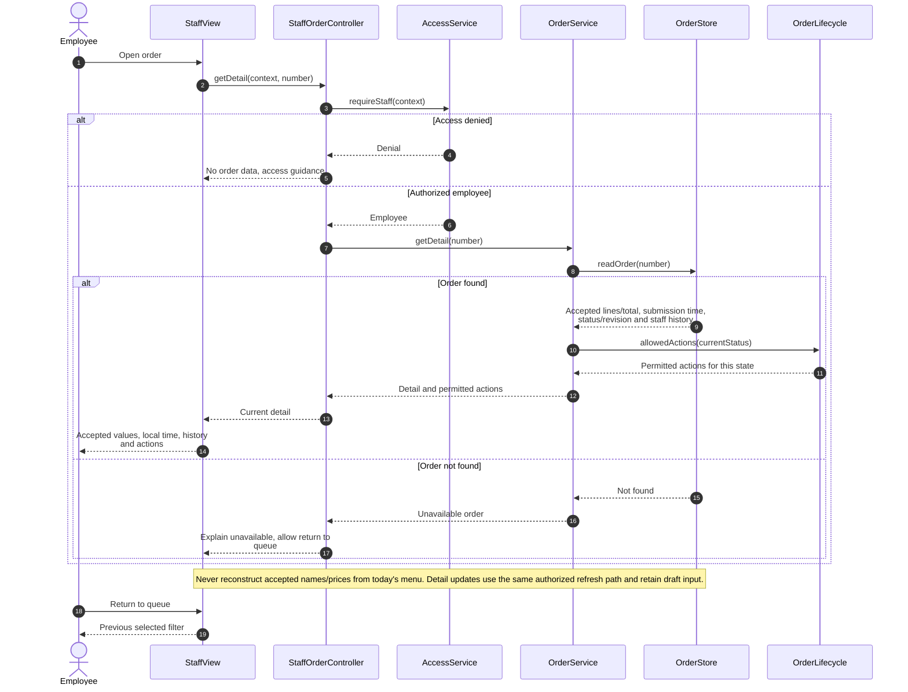
```mermaid
%%{init: {"sequence": {"wrap": true, "width": 200, "actorMargin": 35}}}%%
sequenceDiagram
    autonumber
    actor Employee
    participant UI as StaffView
    participant C as StaffOrderController
    participant Access as AccessService
    participant S as OrderService
    participant O as OrderStore
    participant L as OrderLifecycle
    Employee->>UI: Open order
    UI->>C: getDetail(context, number)
    C->>Access: requireStaff(context)
    alt Access denied
    Access-->>C: Denial
    C-->>UI: No order data, access guidance
    else Authorized employee
    Access-->>C: Employee
    C->>S: getDetail(number)
    S->>O: readOrder(number)
    alt Order found
    O-->>S: Accepted lines/total, submission time, status/revision and staff history
    S->>L: allowedActions(currentStatus)
    L-->>S: Permitted actions for this state
    S-->>C: Detail and permitted actions
    C-->>UI: Current detail
    UI-->>Employee: Accepted values, local time, history and actions
    else Order not found
    O-->>S: Not found
    S-->>C: Unavailable order
    C-->>UI: Explain unavailable, allow return to queue
    end
    end
    Note over UI,O: Never reconstruct accepted names/prices from today's menu. Detail updates use the same authorized refresh path and retain draft input.
    Employee->>UI: Return to queue
    UI-->>Employee: Previous selected filter
```

## B3-transition

[Source](diagrams/B3-transition.mmd)

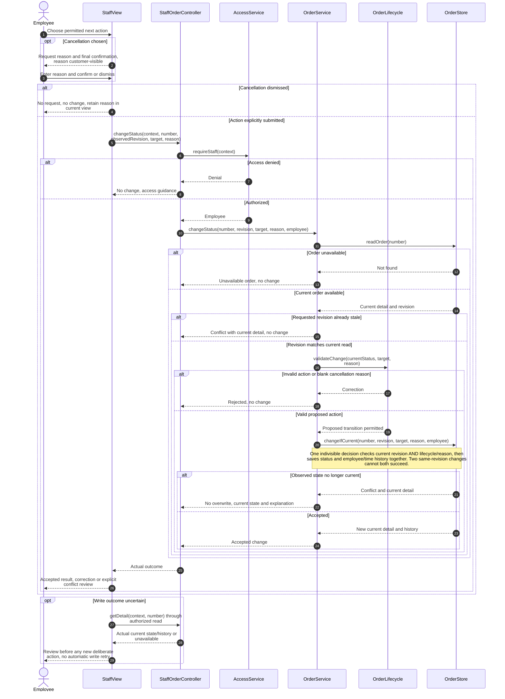
```mermaid
%%{init: {"sequence": {"wrap": true, "width": 200, "actorMargin": 35}}}%%
sequenceDiagram
    autonumber
    actor Employee
    participant UI as StaffView
    participant C as StaffOrderController
    participant Access as AccessService
    participant S as OrderService
    participant L as OrderLifecycle
    participant O as OrderStore
    Employee->>UI: Choose permitted next action
    opt Cancellation chosen
    UI-->>Employee: Request reason and final confirmation, reason customer-visible
    Employee->>UI: Enter reason and confirm or dismiss
    end
    alt Cancellation dismissed
    UI-->>Employee: No request, no change, retain reason in current view
    else Action explicitly submitted
    UI->>C: changeStatus(context, number, observedRevision, target, reason)
    C->>Access: requireStaff(context)
    alt Access denied
    Access-->>C: Denial
    C-->>UI: No change, access guidance
    else Authorized
    Access-->>C: Employee
    C->>S: changeStatus(number, revision, target, reason, employee)
    S->>O: readOrder(number)
    alt Order unavailable
    O-->>S: Not found
    S-->>C: Unavailable order, no change
    else Current order available
    O-->>S: Current detail and revision
    alt Requested revision already stale
    S-->>C: Conflict with current detail, no change
    else Revision matches current read
    S->>L: validateChange(currentStatus, target, reason)
    alt Invalid action or blank cancellation reason
    L-->>S: Correction
    S-->>C: Rejected, no change
    else Valid proposed action
    L-->>S: Proposed transition permitted
    S->>O: changeIfCurrent(number, revision, target, reason, employee)
    Note over S,O: One indivisible decision checks current revision AND lifecycle/reason, then saves status and employee/time history together. Two same-revision changes cannot both succeed.
    alt Observed state no longer current
    O-->>S: Conflict and current detail
    S-->>C: No overwrite, current state and explanation
    else Accepted
    O-->>S: New current detail and history
    S-->>C: Accepted change
    end
    end
    end
    end
    C-->>UI: Actual outcome
    UI-->>Employee: Accepted result, correction or explicit conflict review
    end
    end
    opt Write outcome uncertain
    UI->>C: getDetail(context, number) through authorized read
    C-->>UI: Actual current state/history or unavailable
    UI-->>Employee: Review before any new deliberate action, no automatic write retry
    end
```

## C1-private-summary

[Source](diagrams/C1-private-summary.mmd)

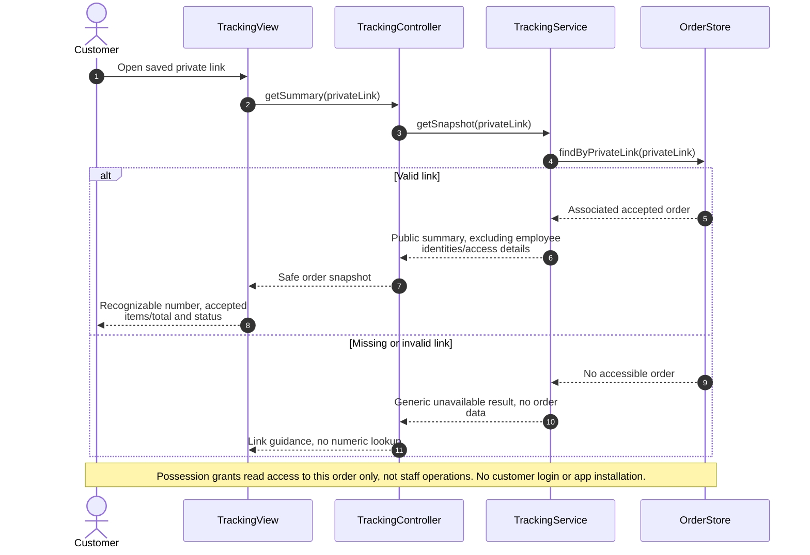
```mermaid
%%{init: {"sequence": {"wrap": true, "width": 200, "actorMargin": 35}}}%%
sequenceDiagram
    autonumber
    actor Customer
    participant UI as TrackingView
    participant C as TrackingController
    participant S as TrackingService
    participant O as OrderStore
    Customer->>UI: Open saved private link
    UI->>C: getSummary(privateLink)
    C->>S: getSnapshot(privateLink)
    S->>O: findByPrivateLink(privateLink)
    alt Valid link
    O-->>S: Associated accepted order
    S-->>C: Public summary, excluding employee identities/access details
    C-->>UI: Safe order snapshot
    UI-->>Customer: Recognizable number, accepted items/total and status
    else Missing or invalid link
    O-->>S: No accessible order
    S-->>C: Generic unavailable result, no order data
    C-->>UI: Link guidance, no numeric lookup
    end
    Note over Customer,O: Possession grants read access to this order only, not staff operations. No customer login or app installation.
```

## C2-tracking-refresh

[Source](diagrams/C2-tracking-refresh.mmd)

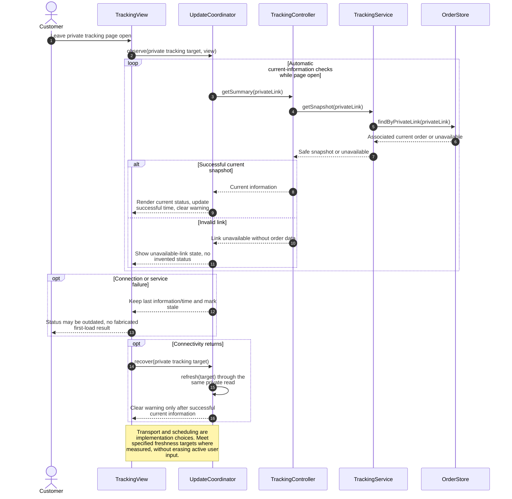
```mermaid
%%{init: {"sequence": {"wrap": true, "width": 200, "actorMargin": 35}}}%%
sequenceDiagram
    autonumber
    actor Customer
    participant UI as TrackingView
    participant U as UpdateCoordinator
    participant C as TrackingController
    participant S as TrackingService
    participant O as OrderStore
    Customer->>UI: Leave private tracking page open
    UI->>U: observe(private tracking target, view)
    loop Automatic current-information checks while page open
    U->>C: getSummary(privateLink)
    C->>S: getSnapshot(privateLink)
    S->>O: findByPrivateLink(privateLink)
    O-->>S: Associated current order or unavailable
    S-->>C: Safe snapshot or unavailable
    alt Successful current snapshot
    C-->>U: Current information
    U-->>UI: Render current status, update successful time, clear warning
    else Invalid link
    C-->>U: Link unavailable without order data
    U-->>UI: Show unavailable-link state, no invented status
    end
    end
    opt Connection or service failure
    U-->>UI: Keep last information/time and mark stale
    UI-->>Customer: Status may be outdated, no fabricated first-load result
    end
    opt Connectivity returns
    UI->>U: recover(private tracking target)
    U->>U: refresh(target) through the same private read
    U-->>UI: Clear warning only after successful current information
    end
    Note over UI,U: Transport and scheduling are implementation choices. Meet specified freshness targets where measured, without erasing active user input.
```

## C3-instructions

[Source](diagrams/C3-instructions.mmd)

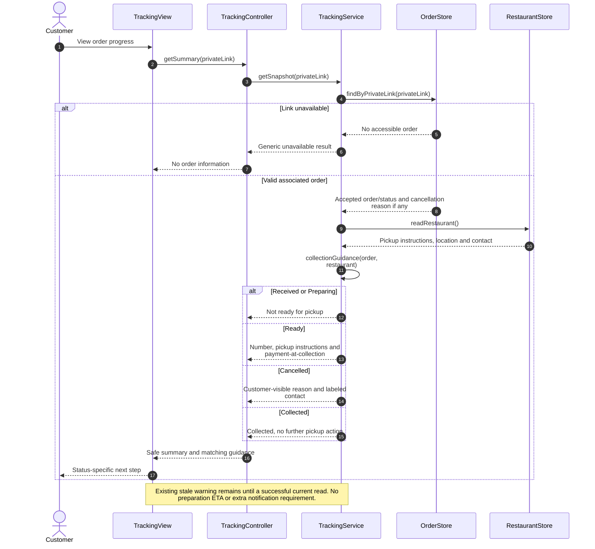
```mermaid
%%{init: {"sequence": {"wrap": true, "width": 200, "actorMargin": 35}}}%%
sequenceDiagram
    autonumber
    actor Customer
    participant UI as TrackingView
    participant C as TrackingController
    participant S as TrackingService
    participant O as OrderStore
    participant R as RestaurantStore
    Customer->>UI: View order progress
    UI->>C: getSummary(privateLink)
    C->>S: getSnapshot(privateLink)
    S->>O: findByPrivateLink(privateLink)
    alt Link unavailable
    O-->>S: No accessible order
    S-->>C: Generic unavailable result
    C-->>UI: No order information
    else Valid associated order
    O-->>S: Accepted order/status and cancellation reason if any
    S->>R: readRestaurant()
    R-->>S: Pickup instructions, location and contact
    S->>S: collectionGuidance(order, restaurant)
    alt Received or Preparing
    S-->>C: Not ready for pickup
    else Ready
    S-->>C: Number, pickup instructions and payment-at-collection
    else Cancelled
    S-->>C: Customer-visible reason and labeled contact
    else Collected
    S-->>C: Collected, no further pickup action
    end
    C-->>UI: Safe summary and matching guidance
    UI-->>Customer: Status-specific next step
    end
    Note over UI,S: Existing stale warning remains until a successful current read. No preparation ETA or extra notification requirement.
```
